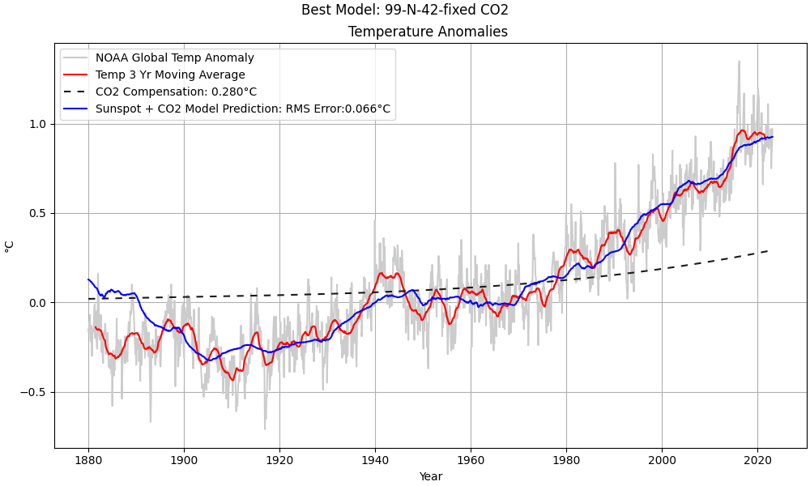
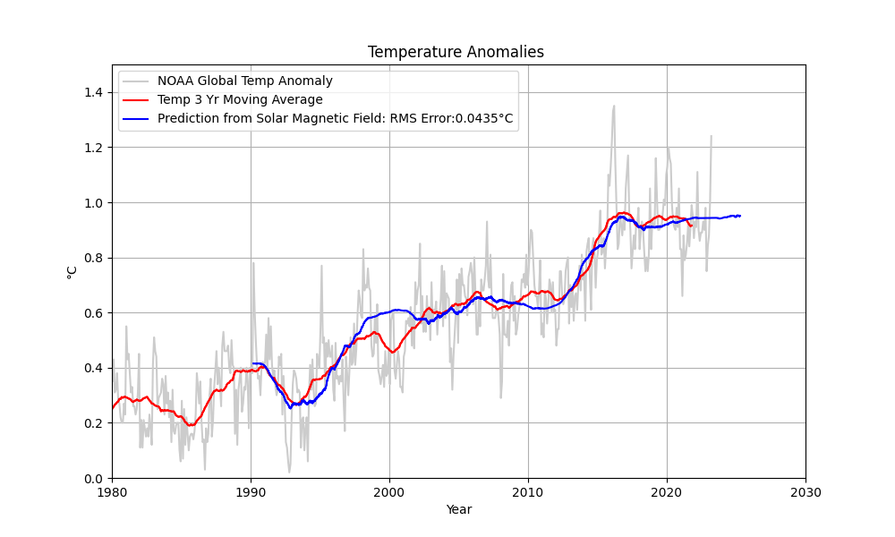

# Global Warming
Two simple, but surprisingly accurate models for predicting global temperatures.  Volcanic activity and climate oscillations will cause the actual temperature to fluctuate around the prediction.
  
The first model is a hybrid model predicting global temperatures using using sunspots and CO2 concentrations.

The second model predicts global temperatures from solar magnetic fields. Note: This model as not yet been validated.

### Brief Model Description
[Brief Sunspot/CO2 Model Description](plots.md)

### Detailed Model Description and Validation
[Full Sunspot/CO2 Model Description and Validation (pdf)](https://localartist.org/media/CutlerModelDescription.pdf)

### To Run
Download the four python program files.
 
Run __tempPredict.py__  for the sunspot/CO2 model
 
Run __tempPredictSolarMagnetic.py__ for the Solar Magnetic Field model

### Changing the Sunspot/CO2 model
There are several different preconfigured models in a comment block.  Copy the desired model *parms* dictionary and replace (or place below) the parms dictionary located just below the comment block.  You can also create your own model by adjusting the parameters of an existing model.
  
Image (png) files showing predictions for a few of the models have been uploaded into this codespace. Click on the filename to view.

### Selecting Sunspot/CO2 Plots
A variable called *showExtra* can be configured to show the model, or the prediction error.
 
Set variable *showSpectrums* to True for plots of the temperature and sunspot spectrums.

### Required Datasets
The first time you run the program it will automatically download the two required datasets.

__WARNING:__ Your results may change, or may not match results shown here as the data sets are constantly being updated and revised.

### Misc
When __getTempSunspotData.py__ is run as a stand-alone program it will plot temperature and sunspot data.
  
When __getSynopticData.py__ is run as a stand-alone program it will plot a synoptic chart and magnetic field data.

### Data Credits
Sunspot Data: WDC-SILSO, [Royal Observatory of Belgium, Brussels](https://www.sidc.be/silso/datafiles)
 
Global Temperature Anomaly Data: [NOAA]( https://www.ncei.noaa.gov/access/monitoring/global-temperature-anomalies/anomalies)
 
Wilcox Solar Observatory Synoptic Charts and Data [WSO](http://wso.stanford.edu/synopticl.html)
