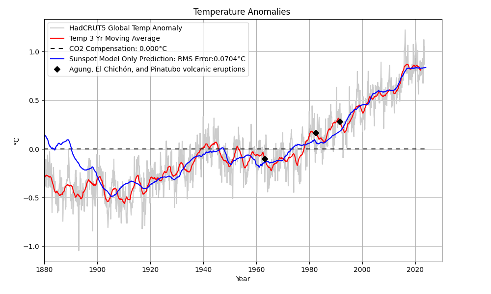

# Global Warming
A simple, but surprisingly accurate model for predicting global temperatures.  Volcanic activity and climate oscillations will cause the actual temperature to fluctuate around the prediction.
  
The model is a hybrid model predicting global temperatures using using sunspots and CO2 concentrations.  
 
Note: Sunspot data accuracy prior to 1800 limits prediction accuracy prior to 1900. See [Muñoz-Jaramillo, A.; Vaquero, J.M., 2019](https://arxiv.org/pdf/2203.11919). However, when comparing the prediction to sea surface temperatures, it's reasonable to question the accuracy of the global temperature data prior to 1900.
 
 
__Sunspots + CO2 model:__

__Sunspot-only model:__

__Sunspot-only model compared to SST:__

### Model Description
[Brief Sunspot/CO2 Model Description](hybridmodel.md)

### To Run
Download the python program files.

Setup the environment:
 
pip install -r requirements.txt

Run __tempPredict.py__  for the sunspot/CO2 model

### Changing the Sunspot/CO2 model
There are several different preconfigured models in a comment block.  Copy the desired model *parms* dictionary and replace (or place below) the parms dictionary located just below the comment block.  You can also create your own model by adjusting the parameters of an existing model.
  
Image (png) files showing predictions for a few of the models have been uploaded into this codespace. Click on the filename to view.

### Selecting Sunspot/CO2 Plots
A variable called *showExtra* can be configured to show the model, or the prediction error.
 
Set variable *showSpectrums* to True for plots of the temperature and sunspot spectrums.

### Required Datasets
The first time you run the program it will automatically download the required datasets.

__WARNING:__ Your results may change, or may not match results shown here as the data sets are constantly being updated and revised.

### Misc
When __getTempSunspotData.py__ is run as a stand-alone program it will plot temperature and sunspot data.
  
When __getSynopticData.py__ is run as a stand-alone program it will plot a synoptic chart, butterfly diagram, and magnetic field data.  This program is not used by the model.

### Data Credits
Sunspot Data: WDC-SILSO, [Royal Observatory of Belgium, Brussels](https://www.sidc.be/silso/datafiles)
  
Global Temperature Anomaly Data HadCRUT5: [Met Office](https://www.metoffice.gov.uk/hadobs/hadcrut5) 
Global Temperature Anomaly Data NOAA: [NOAA]( https://www.ncei.noaa.gov/access/monitoring/global-temperature-anomalies/anomalies)
 
Wilcox Solar Observatory Synoptic Charts and Data [WSO](http://wso.stanford.edu/synopticl.html)
 
El Niño Southern Oscillation (ENSO) data: [NOAA](https://psl.noaa.gov/enso/)
 
NOAA Extended Reconstructed Sea Surface Temperature (SST) V5 data provided by the NOAA PSL, [website](https://psl.noaa.gov)

