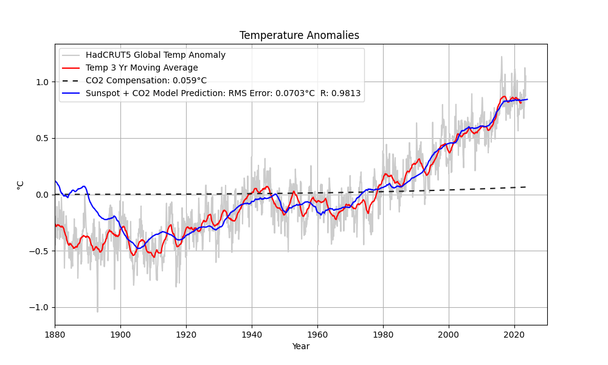
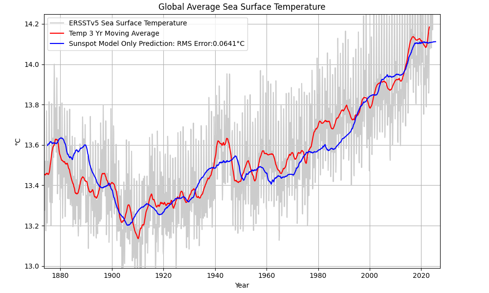
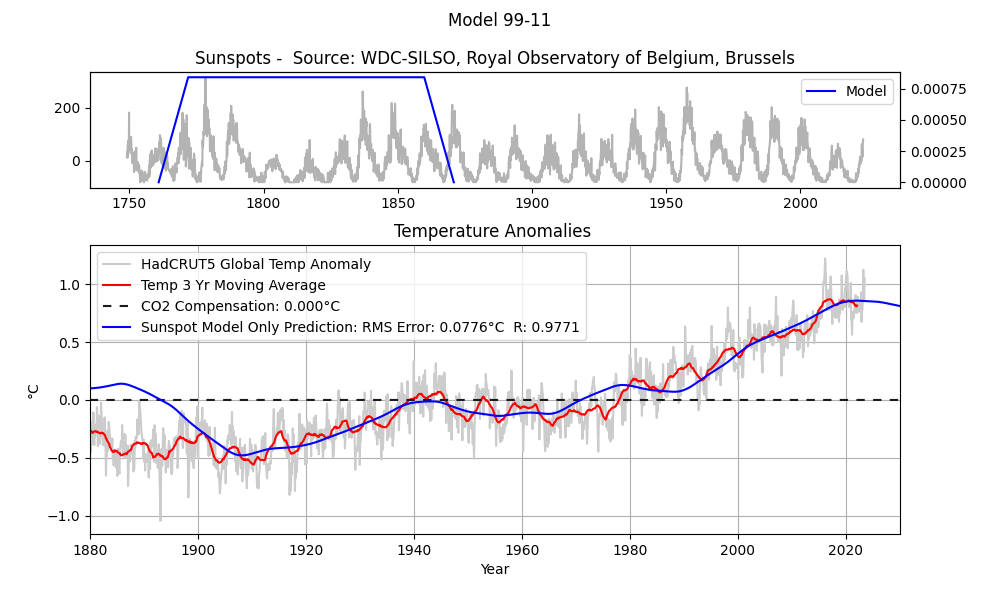
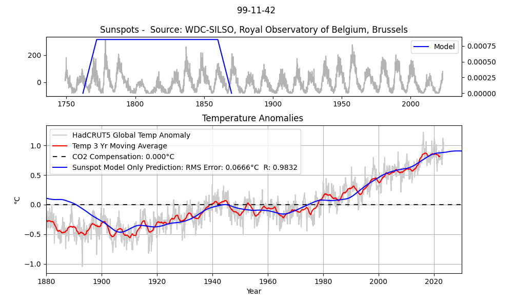

### A Hybrid Model for Predicting Global Temperature
This empirical, or black-box hybrid model predicts temperature by optimally scaling the contributions of a CO2 model, and a sunspot model, 
to minimize temperature prediction error.  As the model can't predict volcanos and minor climate oscillations the temperature will fluctuate around the prediction.  Also, sunspot data accuracy prior to 1800 limits prediction accuracy prior to 1900. See [Muñoz-Jaramillo, A.; Vaquero, J.M., 2019](https://arxiv.org/pdf/2203.11919)
 

## The CO2 Model
The CO2 model is a simple 3rd-order polynomial that closely approximates the log of atmospheric CO2 concentrations.  As the model is monotonic and 
lacking in features, the model only predicts the overall upward trend. Long periods of cooling are not predicted.  This plot shows the 
temperature prediction using only the CO2 model.

## The Sunspot Model
Sunspots don't significantly affect earth's climate. They are a proxy for solar activity. Sunspot characteristics, such as the number of sunspots, and the frequency of the 11-year cycle, change with solar activity.

The sunspot model contains three components:
*  A 98 or 99-Year Moving Average
*  A filter for attenuating the 11-year sunspot cycle energy (either a notch filter, or a short moving average)
*  A method for attenuating energy in the 42-year sunspot cycle.

This plot shows the temperature prediction using only the sunspot model (with the notch filter and 42-year cycle attenuation)

This plot shows the same model compared to NOAA's sea surface temperature dataset.

The 99-Year Moving average supplies most of the information in the prediction. The moving average model is shown positioned over the sunspot
data averaged to produce the first 1880 temperature prediction.  The model is slid to the right to produce the remainder of the predictions  The earliest predictions use sunspot data from the late 1700's to predict the earliest global temperatures, which may explain the less accurate results prior to 1900.

The 99-Year moving average does not sufficiently attenuate the 11-year cycle, hence the 11-year ripples.  Here's the model with both a 
99-year moving average, and an 11-year moving average.  The 11-year moving average works well, but provides a bit too much smoothing.  The notch-filter alternative used in the sunspot-only prediction above produces a more detailed prediction, but eliminates the ability to predict into the future due to a much longer impulse response.

Attenuating the 42-year cycle: improves the accuracy on either side of 1980; sharpens the prediction around the 1940 anomaly and changes the trajectory of the prediction beyond 2023

