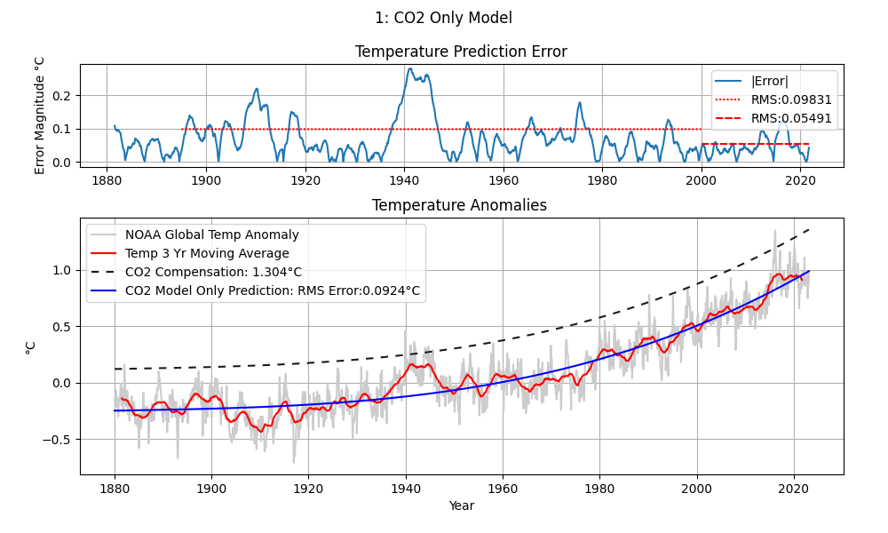
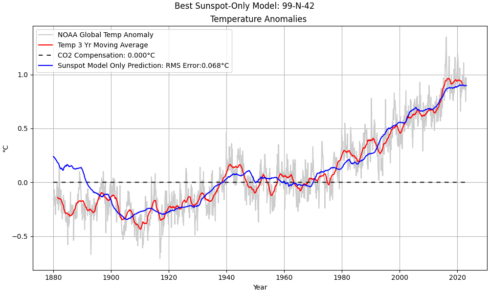
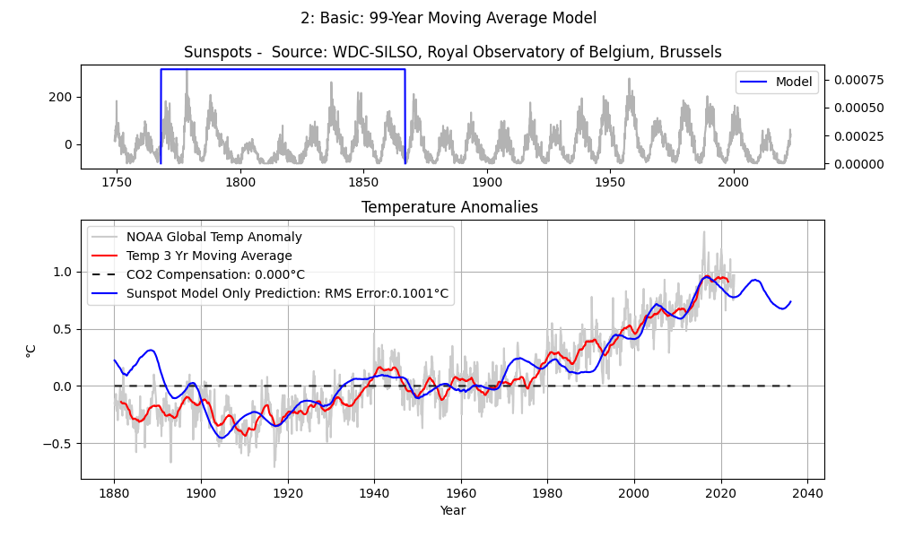
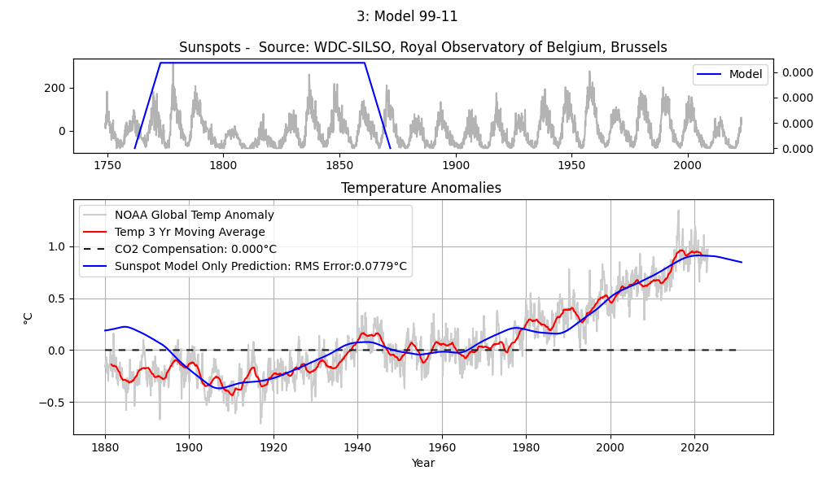
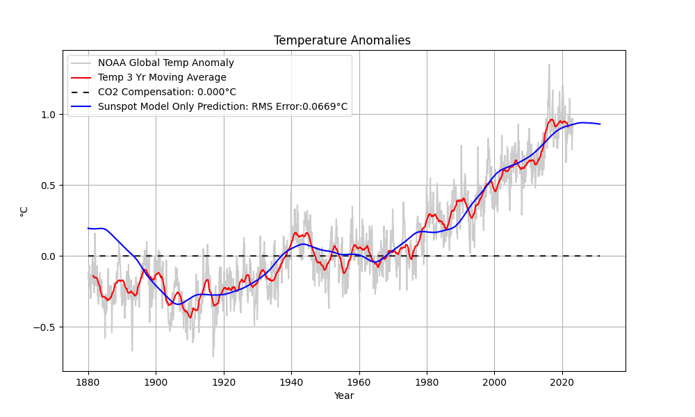

### The Hybrid Model
This black-box hybrid model predicts temperature by optimally scaling the contributions of a CO2 model and a sunspot model 
to minimize temperature prediction error.  As the model can't predict volcanos and climate oscillations (e.g. El Niño-La Niña)
the temperature will fluctuate around the prediction.

## The CO2 Model
The CO2 model is a simple 3rd-order polynomial that approximates the log of atmospheric CO2 concentrations.  As the model is monotonic and lacking in features,
the model only predicts the overall upward trend. Long periods of cooling are not predicted.  This plot shows the temperature prediction using only the CO2 model.

## The Sunspot Model
The sunspot model contains three components:
*  A 98-99 Year Moving Average
*  A filter for attenuating the 11-year sunspot energy (notch filter or short moving average)
*  A method for attenuating energy in the 42-year sunspot cycle.

This plot shows the temperature prediction using only the sunspot model (with notch filter and 42-year cycle attenuation)

The 99-Year Moving average supplies most of the information in the prediction. The moving average model is shown positioned over the sunspot
data averaged to produce the first 1880 temperature prediction.  The earliest predictions use sunspot data from the late 1700's to predict the earliest global temperatures, which may explain the less accurate results prior to 1895.

The 99-Year moving average does not sufficiently attenuate the 11-year cycle.  Here's the model with both a 99-year moving average, 
and an 11-year moving average.

Attenuating the 42-year cycle improves the accuracy on either side of 1980, sharpens the prediction around the 1940 anomaly, and changes the trajectory of the prediction beyond 2023

